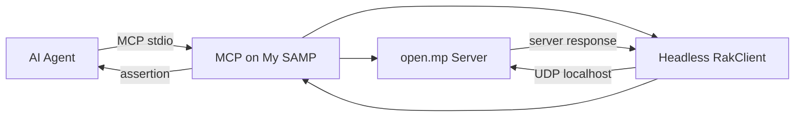

# MCP on My SAMP

<p align="center">
  <strong>AI-native testing bridge untuk server open.mp / SA-MP</strong><br>
  Jalankan, kendalikan, dan verifikasi game server lokal melalui MCP.
</p>

<p align="center">
  <a href="https://github.com/marhenrik635-oss/mcponmysamp/actions"></a>
  <br>
  
  
  <a href="LICENSE"></a>
</p>

> **Scope:** local server atau server yang kamu miliki/izinkan. Bukan tool untuk public-server automation.

---

## Apa yang bisa dilakukan?

MCP on My SAMP membuat AI agent dapat menguji server game dengan workflow yang dapat diulang:

- start / stop / cek status open.mp;
- start / stop / cek status headless RakClient;
- menunggu client benar-benar `Spawned`;
- mengirim command slash yang diizinkan;
- membaca history output client;
- memverifikasi response server sudah diterima client;
- menemukan command dari source Pawn gamemode;
- menolak command di luar allowlist.

Tidak menyediakan flood, spam, lag injection, arbitrary RCON, atau automation ke server publik.

## Alur kerja



Bukti round-trip yang valid:

```text
command dikirim
→ server callback menerima command
→ gamemode mengirim response
→ client menerima response
→ MCP assertion berhasil
```

`Spawned` saja bukan bukti command berhasil.

---

## Instalasi

### 1. Siapkan Python

Python **3.10 atau lebih baru** diperlukan.

### 2. Install project

Jalankan dari root repository:

**Windows**

```bat
py -3 -m venv .venv
.venv\Scripts\activate
python -m pip install --upgrade pip
python -m pip install ".[dev]"
```

**Linux / macOS**

```bash
python3 -m venv .venv
source .venv/bin/activate
python -m pip install --upgrade pip
python -m pip install ".[dev]"
```

### 3. Verifikasi

```bash
pytest -q
```

Output yang diharapkan:

```text
35 passed
```

> Binary open.mp dan RakClient hanya diperlukan untuk live test. Unit test Python tetap bisa dijalankan tanpa binary tersebut.

---

## Konfigurasi

Buat file konfigurasi lokal dari template:

**Windows**

```bat
copy config.example.json local-server.json
```

**Linux / macOS**

```bash
cp config.example.json local-server.json
```

Isi file:

```json
{
  "executable": "vendor/openmp/Server/omp-server.exe",
  "working_dir": "vendor/openmp/Server",
  "args": ["--config-path", "config.json"],
  "ready_text": "Legacy Network started on port",
  "startup_timeout": 30
}
```

Ubah `executable` dan `working_dir` sesuai lokasi open.mp di komputer kamu. `local-server.json` tidak masuk Git karena path setiap komputer berbeda.

---

## Menjalankan MCP server

### Server saja

```bash
mcp-gta-samp --config local-server.json
```

### Dengan headless RakClient

**Windows**

```bat
mcp-gta-samp ^
  --config local-server.json ^
  --client-executable vendor/rakclient-bin/rakclient.exe ^
  --client-arg --server ^
  --client-arg 127.0.0.1:7777 ^
  --client-arg --nick ^
  --client-arg MCPBot ^
  --client-arg --scripts-dir ^
  --client-arg vendor/rakclient-bin/scripts ^
  --gamemode-source vendor/openmp/Server/gamemodes/mcp_test.pwn
```

**Linux / macOS**

```bash
mcp-gta-samp \
  --config local-server.json \
  --client-executable vendor/rakclient-bin/rakclient \
  --client-arg --server \
  --client-arg 127.0.0.1:7777 \
  --client-arg --nick \
  --client-arg MCPBot \
  --client-arg --scripts-dir \
  --client-arg vendor/rakclient-bin/scripts \
  --gamemode-source vendor/openmp/Server/gamemodes/mcp_test.pwn
```

Transport MCP menggunakan **stdio**.

---

## MCP tools

| Tool | Fungsi |
|---|---|
| `server_start` | Menyalakan server dan menunggu readiness. |
| `server_status` | Mengecek status server dan PID. |
| `server_stop` | Mematikan server. |
| `client_start` | Menyalakan headless RakClient. |
| `client_status` | Mengecek status client. |
| `client_stop` | Mematikan client. |
| `client_send_chat` | Mengirim command slash yang diizinkan setelah `Spawned`. |
| `client_get_history` | Mengambil output client yang sudah dibuffer. |
| `client_assert_output` | Memastikan output tertentu diterima client. |
| `server_list_commands` | Menampilkan command dari source Pawn. |
| `server_assert_command` | Memvalidasi command terhadap allowlist. |

Dua tool terakhir tersedia jika `--gamemode-source` digunakan.

---

## Workflow untuk AI agent

```text
1. server_status
2. server_start jika belum berjalan
3. client_start
4. tunggu state Spawned
5. server_list_commands
6. server_assert_command("/help")
7. client_send_chat("/help")
8. client_assert_output("MCP Test Commands:")
9. client_get_history bila perlu diagnosis
10. client_stop
11. server_stop
```

Instruksi penting untuk agent:

- jangan mengakses public server;
- jangan menganggap boot, join, atau `Spawned` sebagai command round-trip;
- jika gagal, klasifikasikan boundary: boot, koneksi, spawn, queue, outbound packet, callback server, response server, parser client, atau assertion MCP;
- selalu hentikan proses setelah test;
- pastikan port UDP `7777` kembali kosong.

---

## Live test example

Gamemode test tersedia di:

```text
vendor/openmp/Server/gamemodes/mcp_test.pwn
```

Command yang tersedia:

```text
/help
/status
```

Jika source Pawn diubah, compile ulang `.amx` dari folder server:

```bat
qawno\pawncc.exe -i.\qawno\include -o.\gamemodes\mcp_test .\gamemodes\mcp_test.pwn
```

Workflow live:

```text
server_start
→ client_start
→ client mencapai Spawned
→ client_send_chat("/help")
→ client_assert_output("MCP Test Commands:")
→ client_assert_output("/status - show a test response")
→ client_stop
→ server_stop
```

Headless RakClient membuktikan protocol, state, dan command. Ia **tidak menghasilkan screenshot**. Pengujian visual memerlukan rendered GTA client terpisah.

---

## Pengembangan

Menjalankan test:

```bash
pytest -q
```

Membuat wheel:

```bash
python -m pip wheel . --no-deps -w dist
```

Install wheel:

```bash
python -m pip install dist/mcp_gta_samp-0.1.0-py3-none-any.whl
```

Struktur inti:

```text
mcp_gta_samp/       package Python dan MCP facade
tests/              unit, contract, dan bridge tests
config.example.json template konfigurasi
vendor/             binary dan fixture live test
```

---

## Keamanan

MCP ini membatasi penggunaan pada local/owned server. Jangan memasukkan credential, proxy pool, config privat, log privat, atau data test server ke repository publik.

Jika menjalankan server dari internet, tambahkan authentication dan network isolation sendiri. Package ini tidak dirancang sebagai game-control API publik.

## Lisensi

MIT License. Lihat [LICENSE](LICENSE).

## Tautan

- Repository: [marhenrik635-oss/mcponmysamp](https://github.com/marhenrik635-oss/mcponmysamp)
- Issues: [laporkan masalah](https://github.com/marhenrik635-oss/mcponmysamp/issues)

<p align="center">
  Dibuat untuk testing open.mp / SA-MP yang terukur, aman, dan dapat diverifikasi.
</p>
